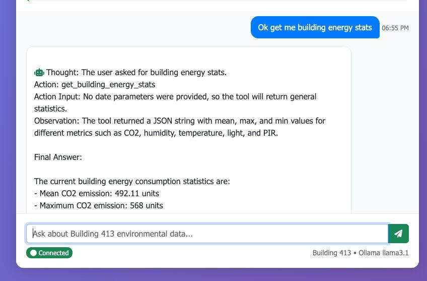
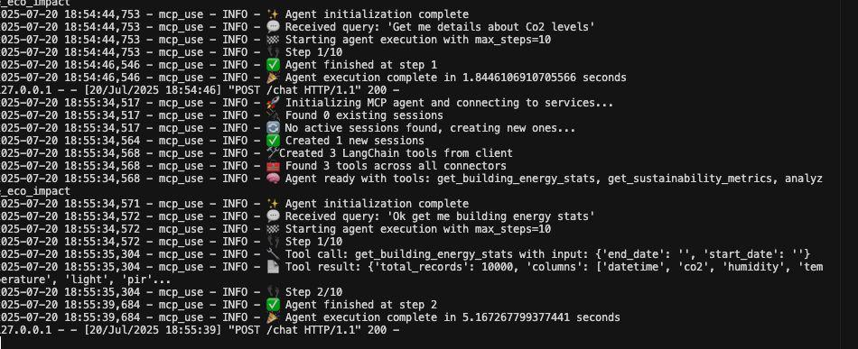

# Building 413 Smart Environmental Monitor

A Flask-based web application with MCP (Model Context Protocol) integration for analyzing Building 413 environmental sensor data using Ollama's llama3.1 model.

## 🏢 Overview

This application provides AI-powered analysis of Building 413's environmental data including CO2 levels, temperature, humidity, light levels, and motion detection. It uses a clean Flask frontend with the `mcp-use` library to communicate with an MCP server that processes real building sensor data.

## 📷 Screenshots

### Frontend - Web Chat Interface


*The Flask web application showing the Building 413 chat interface with AI-powered responses. Users can ask natural language questions about environmental data and receive detailed analytics.*

### Backend - MCP Server Logs


*The MCP server running in the terminal, showing real-time processing of user queries, tool execution, and data analysis. The server handles requests from the frontend and processes building sensor data.*

## 🏗️ Architecture

```
sustainable-eco-report-chatapp/
├── frontend/
│   ├── flask_app.py              # Flask web app with mcp-use + Ollama (AI-powered)
│   ├── flask_app_simple.py       # Flask web app with direct MCP imports (⭐ Recommended)
│   ├── requirements.txt          # Frontend dependencies
│   └── templates/
│       └── chat.html             # Professional Arabic/English UI
├── backend/
│   ├── mcp_server.py             # MCP tools for building analysis
│   ├── run_server.py             # HTTP server wrapper (uvicorn)
│   └── requirements.txt          # Backend dependencies (minimal)
├── dataset/
│   └── building_413_data.csv     # Building 413 sensor data (8,640 records)
├── screenshots/                  # Application screenshots
│   ├── 1.jpeg                   # Main interface
│   └── 2.jpeg                   # AI analysis example
├── create_dataset.py             # Script to generate synthetic data
├── START_APP.bat                 # One-click startup script (Windows)
├── .env                          # Environment configuration (create from .env.example)
├── .env.example                  # Environment template
└── README.md                     # This file
```

## ✨ Features

- 🤖 **Smart Chat Interface** - Natural language queries in Arabic & English
- 📊 **Real-Time Analysis** - Live building energy statistics and environmental metrics
- 🌿 **Sustainability Insights** - CO2 analysis, energy recommendations, and eco-impact calculations
- 🏢 **Building 413 Focus** - Specialized for single building monitoring with 8,640 sensor readings
- 🔧 **MCP Integration** - Uses Model Context Protocol for structured data access
- 💬 **Professional Reports** - Beautiful HTML reports with gradients, tables, and Arabic RTL support
- ⚡ **Two Modes** - Choose between fast direct access or AI-powered intelligent routing
- 🎨 **Shaheen Branding** - Professional green & gold color scheme

## 🚀 Prerequisites

### Required Software
1. **Python 3.12+** - For running Flask and MCP services
2. **Ollama** - Local AI model server
3. **Modern web browser** - For accessing the web interface

### Install Ollama and Model
```bash
# Install Ollama (visit https://ollama.ai for platform-specific instructions)
# Then download the required model:
ollama pull llama3.1
```

## 📦 Installation

### 1. Clone Repository
```bash
git clone https://github.com/CodersLaunchpad/sustainable-eco-report-chatapp.git
cd sustainable-eco-report-chatapp
```

### 2. Environment Setup
```bash
cp .env.example .env
# Edit .env if needed (default settings should work)
```

### 3. Install Dependencies

**Backend (MCP Server):**
```bash
cd backend
pip install -r requirements.txt
cd ..
```

**Frontend (Flask App):**
```bash
cd frontend
pip install -r requirements.txt
cd ..
```

## 🎯 Usage

### Quick Start (Windows)
**Double-click `START_APP.bat`** - Automatically starts both backend and frontend!

### Manual Start

#### 1. Start Backend (MCP Server)
```bash
cd backend
python run_server.py
```
*Server will start on http://localhost:4141/sse*

#### 2. Start Frontend

**Option A: Simple Version (⭐ Recommended - Fastest)**
```bash
cd frontend
python flask_app_simple.py
```

**Option B: AI-Powered Version (Uses Ollama)**
```bash
# Make sure Ollama is running first
ollama serve

# Then start frontend
cd frontend
python flask_app.py
```

*Web interface will be available at http://localhost:5000*

#### 3. Access the Application
Open your browser and navigate to **http://localhost:5000**

### Frontend Comparison

| Version | File | Speed | AI Features | Best For |
|---------|------|-------|-------------|----------|
| **Simple** ⭐ | `flask_app_simple.py` | Fastest | Direct keyword matching | Production, demos |
| **AI-Powered** | `flask_app.py` | Slower | Ollama LLM routing | Advanced queries |

## 💬 Example Queries

Try these natural language queries in the chat interface:

### Basic Information (English & Arabic)
- `"Hello!"` / `"مرحبا"` - Simple greeting
- `"Help"` / `"مساعدة"` - Get system information

### Building Data Analysis
**English:**
- `"Get building energy stats"` - Complete environmental overview
- `"Show me CO2 levels"` - Air quality analysis
- `"What's the temperature and humidity?"` - Climate conditions

**Arabic:**
- `"احصل على إحصائيات الطاقة"` - تقرير شامل للبيئة
- `"أظهر مقاييس الاستدامة"` - مقاييس الاستدامة
- `"احسب البصمة الكربونية"` - البصمة الكربونية

### Sustainability Insights
- `"Get sustainability metrics"` - Energy recommendations
- `"Calculate carbon footprint"` - Environmental impact
- `"Show water usage analysis"` - Resource consumption

### What You'll Get

Professional Arabic/English reports featuring:
- ⚡ Shaheen branding with green & gold gradients
- 📋 Document metadata (report number, date, classification)
- 📊 Executive summary with key metrics cards
- 📈 Detailed statistics tables (average, maximum, minimum)
- 💡 Actionable recommendations in Arabic
- ✅ Professional footer with compliance info

## 🔧 Technical Details

### MCP Tools Available
The system provides three main MCP tools for building analysis:

1. **`get_building_energy_stats()`** - Comprehensive building data with mean/max/min values
2. **`get_sustainability_metrics()`** - Energy recommendations and insights
3. **`analyze_eco_impact()`** - Carbon footprint and environmental analysis

### Data Sources
- **Building 413 Sensor Data**: 10,000+ environmental readings
- **Sensor Types**: CO2, Temperature, Humidity, Light, PIR Motion
- **Data Format**: CSV with timestamp-indexed measurements

### AI Processing
- **Model**: Ollama llama3.1 (local deployment)
- **Client**: mcp-use library for MCP communication
- **Processing**: Intelligent query routing to appropriate tools

## 🔍 Troubleshooting

### Common Issues

**"MCP server not responding"**
- Ensure MCP server is running on port 4141
- Check that `python mcp_server.py` started successfully

**"Ollama connection failed"**
- Verify Ollama is installed and running
- Confirm llama3.1 model is downloaded: `ollama list`

**"Building data not found"**
- Check that `dataset/building_413_data.csv` exists
- Verify file permissions and path

### Logs and Debugging
- **MCP Server Logs**: Check terminal running `mcp_server.py`
- **Flask App Logs**: Check terminal running `flask_app.py`
- **Browser Console**: F12 for frontend debugging

## 🌱 Building 413 Data Overview

The application analyzes environmental sensor data from Building 413:

- **📊 Total Records**: 8,640 sensor readings (30 days, 5-minute intervals)
- **🌡️ Temperature**: 22-28°C range with optimal HVAC control
- **💨 CO2 Levels**: 400-650 ppm (excellent air quality)
- **💧 Humidity**: 35-55% (optimal comfort range)
- **💡 Light Levels**: 0-250 lux (occupancy-based lighting)
- **👥 Motion Detection**: PIR sensor showing occupancy patterns

### Data Generation
The dataset can be regenerated with custom parameters using:
```bash
python create_dataset.py
```
This creates realistic synthetic data with:
- Working hours vs. night patterns
- Weekday vs. weekend variations
- Seasonal adjustments
- Peak hour anomalies

## 🤝 Contributing

1. Fork the repository
2. Create a feature branch
3. Make your changes
4. Test thoroughly
5. Submit a pull request

## 📊 Dataset Information

The environmental sensor data used in this application is sourced from **[Kaggle Smart Building System Dataset](https://www.kaggle.com/datasets/ranakrc/smart-building-system/data)** and contains comprehensive building monitoring data. While this application focuses on **Building 413**, the complete dataset includes sensor data from **multiple buildings** (413, 415, 417, 419, 421, 422, 423, 424, 442, 446, 448, 452, 454, 456, 458, 462, 510, 511, 513, 552, 554, 556, 558, 562, 564, 621, 621A, 621C, 621D, 621E, 640, 644, 648, 656A, 656B, 664, 666, 668, 717, 719, 721, 722, 723, 724, 726, 734, 746, 748, 752, 754, 776) available in the original dataset.

Each building contains the same sensor types:
- **CO2 levels** (ppm)
- **Temperature** (°C) 
- **Humidity** (%)
- **Light levels** (lux)
- **PIR motion detection**

This rich dataset opens possibilities for expanding the application to support multi-building analysis, comparative studies, and campus-wide environmental monitoring.

## 📄 License

This project is licensed under the MIT License.

## 🔗 Links

- [Ollama](https://ollama.ai) - Local AI model server
- [MCP Protocol](https://modelcontextprotocol.io) - Model Context Protocol
- [Flask](https://flask.palletsprojects.com/) - Python web framework